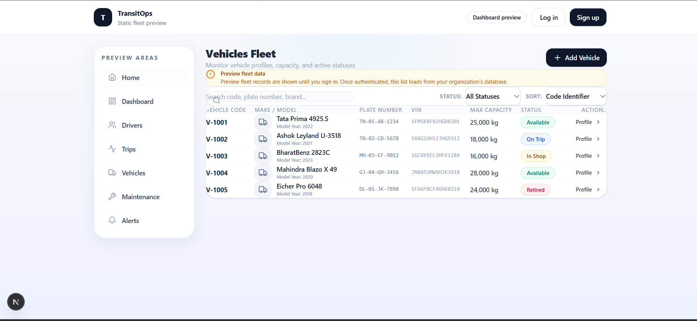
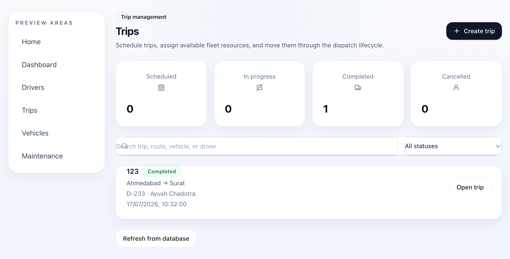
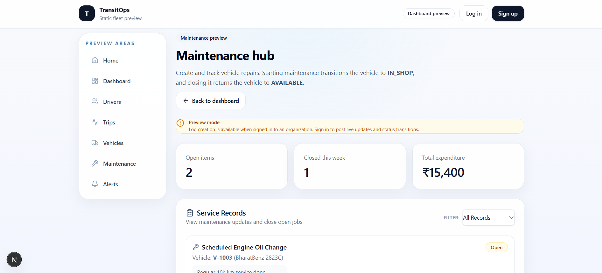
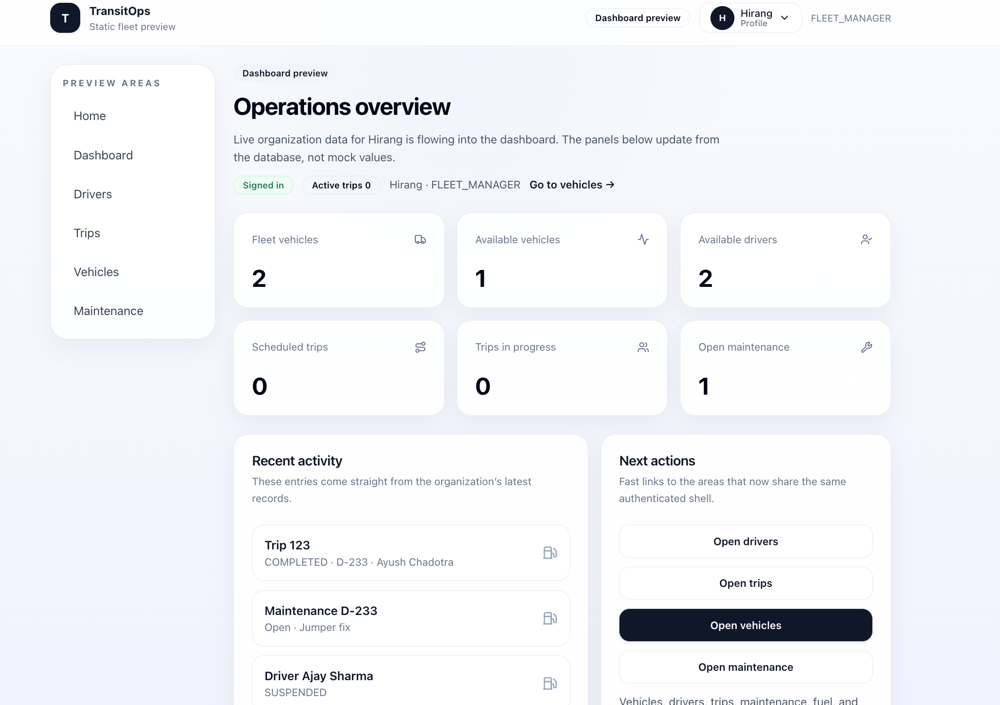

# 🚛 RouteOps

### Smart Fleet Operations. Simplified.

RouteOps is a modern fleet and transport operations management platform designed to centralize **vehicles, drivers, trips, maintenance, expenses, and operational analytics** into one unified system.

Built during an **8-hour hackathon**, RouteOps replaces fragmented spreadsheets and manual workflows with a dynamic, data-driven platform for efficient fleet operations.

---

## 📸 Screenshots

<table>
  <tr>
    <td width="50%">
      
    </td>
    <td width="50%">
      
    </td>
  </tr>
  <tr>
    <td align="center"><b>Vehicle Management</b></td>
    <td align="center"><b>Trip Management</b></td>
  </tr>
</table>

<br />

<table>
  <tr>
    <td width="50%">
      
    </td>
    <td width="50%">
      
    </td>
  </tr>
  <tr>
    <td align="center"><b>Maintenance Management</b></td>
    <td align="center"><b>Fleet Analytics</b></td>
  </tr>
</table>

---

## 💡 The Problem

Transport operations often depend on disconnected spreadsheets, manual records, and isolated systems.

This creates several operational challenges:

- 🚫 Vehicle and driver double-booking
- 📋 Poor visibility into fleet availability
- ⚠️ Assignment of unavailable vehicles
- 🪪 Dispatching drivers with expired licenses
- 📦 Cargo overloading
- 🔧 Disconnected maintenance records
- ⛽ Poor fuel and expense tracking
- 📊 Lack of real-time operational insights

**RouteOps solves these problems by bringing the complete fleet lifecycle into one centralized platform.**

---

## ✨ Key Features

### 🚚 Fleet Management

Manage the complete vehicle registry from a centralized interface.

- Create, view, update, and delete vehicles
- Track registration and vehicle information
- Monitor maximum load capacity
- Track odometer readings
- Manage vehicle status
- Search and filter fleet records
- Automatically synchronize vehicle availability with trips and maintenance

---

### 👨‍✈️ Driver Management

Maintain driver records and monitor driver eligibility.

- Create and manage driver profiles
- Track license information
- Monitor license expiry dates
- Maintain safety scores
- Track driver availability
- Prevent suspended drivers from receiving assignments
- Prevent drivers with expired licenses from being dispatched

---

### 🗺️ Trip Management

Manage the complete trip lifecycle from creation to completion.

- Create and manage trips
- Assign available vehicles and eligible drivers
- Track source and destination
- Record cargo weight and planned distance
- Dispatch trips
- Complete trips
- Cancel trips
- Automatically synchronize vehicle and driver statuses

RouteOps validates critical business rules before allowing a trip to be dispatched.

The system prevents:

- ❌ Assignment of unavailable vehicles
- ❌ Assignment of vehicles under maintenance
- ❌ Assignment of retired vehicles
- ❌ Assignment of suspended drivers
- ❌ Assignment of drivers with expired licenses
- ❌ Cargo exceeding vehicle capacity
- ❌ Vehicle double-booking
- ❌ Driver double-booking

---

### 🔄 Automated Status Management

RouteOps automatically synchronizes operational states across the platform.

```text
Trip Dispatched
      │
      ├── Vehicle → ON_TRIP
      │
      └── Driver  → ON_TRIP

Trip Completed / Cancelled
      │
      ├── Vehicle → AVAILABLE
      │
      └── Driver  → AVAILABLE

Maintenance Started
      │
      └── Vehicle → IN_SHOP

Maintenance Completed
      │
      └── Vehicle → AVAILABLE
```

This reduces manual errors and keeps operational data consistent across the platform.

---

### 🔧 Maintenance Management

Track vehicle maintenance activities and costs.

- Create maintenance records
- Track maintenance type and description
- Record maintenance costs
- Monitor maintenance status
- Track start and completion dates
- Automatically update vehicle availability

Vehicles undergoing maintenance are automatically excluded from trip assignments.

---

### ⛽ Fuel & Expense Tracking

Monitor operational spending across the fleet.

- Record fuel usage
- Track fuel expenses
- Associate fuel logs with vehicles and trips
- Record operational expenses
- Categorize expenses
- Calculate vehicle operating costs

---

### 📊 Dynamic Dashboard

RouteOps provides a centralized dashboard powered by dynamic operational data.

The dashboard tracks:

- 🚚 Total Vehicles
- ✅ Available Vehicles
- 🔧 Vehicles Under Maintenance
- 🗺️ Active Trips
- ⏳ Pending Trips
- 👨‍✈️ Drivers On Duty
- 📈 Fleet Utilization
- 💰 Operational Expenses

Changes made throughout the platform are dynamically reflected in the dashboard and analytics.

---

### 📈 Analytics & Reports

Transform fleet data into actionable operational insights.

- Fleet utilization analytics
- Vehicle status distribution
- Operational cost analysis
- Fuel efficiency insights
- Recent trip activity
- Dynamic charts and visualizations
- Search and filtering
- CSV data export

---

## 🔐 Authentication & Role-Based Access Control

RouteOps implements secure authentication and role-based authorization.

| Role | Responsibilities |
| --- | --- |
| 🚚 Fleet Manager | Vehicle management and fleet operations |
| 🗺️ Dispatcher | Trip creation, assignment, and dispatch operations |
| 🛡️ Safety Officer | Driver management and compliance monitoring |
| 💰 Financial Analyst | Fuel, expenses, costs, and financial analytics |

Users only have access to functionality relevant to their assigned responsibilities.

---

## 🛠️ Tech Stack

### Frontend


- Next.js
- React
- TypeScript
- Tailwind CSS
- shadcn/ui
- React Hook Form
- Zod
- Recharts

### Backend

- Next.js Server Actions / Route Handlers
- Auth.js
- Prisma ORM

### Database

- PostgreSQL
- Neon

### Deployment & Development

- Vercel
- Git
- GitHub

---

## 🏗️ Architecture

RouteOps follows a modular full-stack architecture.

```text
                         RouteOps
                            │
                            ▼
                    Next.js Application
                            │
             ┌──────────────┴──────────────┐
             │                             │
             ▼                             ▼
        React Frontend                 Server Layer
             │                             │
             │                  ┌──────────┴──────────┐
             │                  │                     │
             ▼                  ▼                     ▼
        shadcn/ui            Auth.js           Business Logic
        Tailwind CSS           RBAC              Validation
        Recharts                              State Transitions
                                                     │
                                                     ▼
                                                Prisma ORM
                                                     │
                                                     ▼
                                              PostgreSQL
                                                     │
                                                     ▼
                                                   Neon
```

The application follows a **modular monolith architecture**, providing rapid development while maintaining clear separation between UI, business logic, authentication, and data access.

---

## 🗄️ Core Data Model

```text
Organization
│
├── Users
│
├── Vehicles
│   ├── Trips
│   ├── Maintenance Records
│   ├── Fuel Logs
│   └── Expenses
│
├── Drivers
│   └── Trips
│
└── Operational Analytics
```

---

## ⚙️ How RouteOps Works

```text
User Action
    │
    ▼
Server Action / API
    │
    ▼
Business Rule Validation
    │
    ▼
Prisma ORM
    │
    ▼
PostgreSQL Database
    │
    ▼
Updated Application State
    │
    ▼
Dashboard & Analytics
```

Critical business rules are validated on the server before data is modified.

---

## 🚦 Trip Lifecycle

```text
Create Trip
    │
    ▼
Validate Vehicle Availability
    │
    ▼
Validate Driver Eligibility
    │
    ▼
Validate License Expiry
    │
    ▼
Validate Cargo Capacity
    │
    ▼
Dispatch Trip
    │
    ├── Vehicle → ON_TRIP
    │
    └── Driver  → ON_TRIP
    │
    ▼
Complete / Cancel Trip
    │
    ├── Vehicle → AVAILABLE
    │
    └── Driver  → AVAILABLE
```

This workflow ensures consistent operational data and prevents invalid fleet assignments.

---

## 🚀 Getting Started

### Prerequisites

Make sure you have installed:

- Node.js
- npm
- Git
- A PostgreSQL database or Neon account

### 1️⃣ Clone the Repository

```bash
git clone <repository-url>
cd RouteOps
```

### 2️⃣ Install Dependencies

```bash
npm install
```

### 3️⃣ Configure Environment Variables

Create a `.env` or `.env.local` file in the project root.

```env
DATABASE_URL="your-postgresql-database-url"

AUTH_SECRET="your-auth-secret"

AUTH_URL="http://localhost:3000"
```

Generate an authentication secret:

```bash
openssl rand -base64 32
```

### 4️⃣ Generate Prisma Client

```bash
npx prisma generate
```

### 5️⃣ Apply Database Migrations

```bash
npx prisma migrate deploy
```

For local development:

```bash
npx prisma migrate dev
```

### 6️⃣ Start the Development Server

```bash
npm run dev
```

Open the application at:

```text
http://localhost:3000
```

---

## 📁 Project Structure

```text
RouteOps/
│
├── app/
│   ├── dashboard/
│   ├── vehicles/
│   ├── drivers/
│   ├── trips/
│   ├── maintenance/
│   ├── expenses/
│   └── reports/
│
├── components/
│   ├── ui/
│   └── shared/
│
├── lib/
│   ├── prisma.ts
│   ├── auth.ts
│   └── utils.ts
│
├── prisma/
│   └── schema.prisma
│
├── public/
│   └── screenshots/
│
├── CONTEXT.md
├── package.json
└── README.md
```

---

## 🎯 Demo Workflow

A complete RouteOps workflow demonstrates the transport operations lifecycle:

1. 🔐 Log into the platform
2. 🚚 Register vehicles
3. 👨‍✈️ Register drivers
4. 🗺️ Create a new trip
5. 🔍 Assign an available vehicle and eligible driver
6. ⚖️ Validate cargo capacity and driver compliance
7. 🚦 Dispatch the trip
8. 🔄 Automatically update vehicle and driver statuses
9. 🏁 Complete or cancel the trip
10. 🔧 Create vehicle maintenance records
11. 🚫 Automatically prevent in-shop vehicles from being dispatched
12. ⛽ Record fuel usage and operational expenses
13. 📊 View updated KPIs and analytics
14. 📥 Export operational data

---

## 🌟 Future Scope

RouteOps can be extended with:

- 📍 Real-time GPS vehicle tracking
- 🗺️ Intelligent route optimization
- 🔮 Predictive vehicle maintenance
- 🔔 Automated driver license expiry notifications
- 📧 Email and push notifications
- 📄 Vehicle document management
- 📊 Advanced financial reporting
- 🤖 AI-powered fleet insights
- 🌎 Multi-region fleet operations
- 📱 Mobile applications for drivers and fleet managers

---

## 👥 Team

Built with collaboration, rapid iteration, and a shared vision during an **8-hour hackathon**.

| Contributor | Responsibility |
| --- | --- |
| [Member 1](https://github.com/lassi-ui) | Fleet Management & Integration |
| [Member 2](https://github.com/HirPtl10) | Database, Drivers & Finance |
| [Member 3](https://github.com/MANAV-PATEL13) | Authentication, RBAC & Trip Management |
| [Member 4](https://github.com/Ayush-9010) | Design System, Maintenance & Analytics |

---

## 🤝 Contributing

Contributions, suggestions, and feedback are welcome.

1. Fork the repository
2. Create a feature branch
3. Commit your changes
4. Push the branch
5. Open a Pull Request

---

## 📄 License

This project was developed as part of a hackathon submission.

---

<div align="center">

### 🚛 RouteOps

**Smarter Fleets. Better Operations.**

Built with ❤️ during an 8-hour hackathon.

</div>
